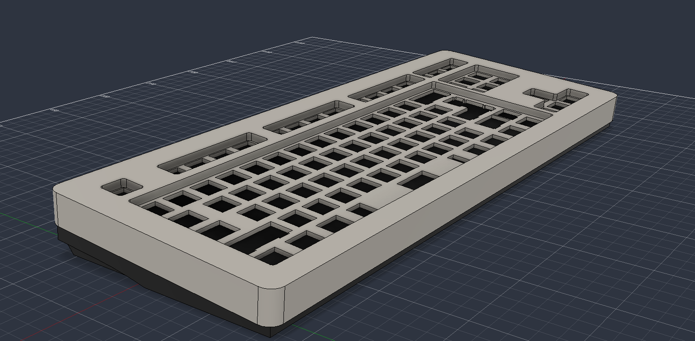
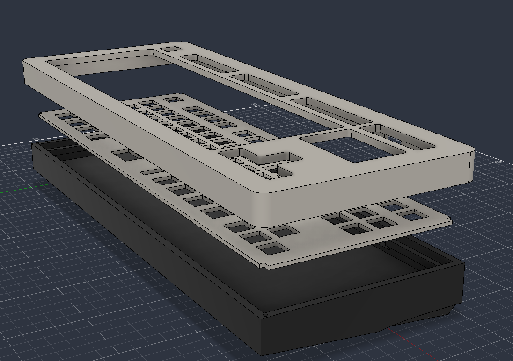
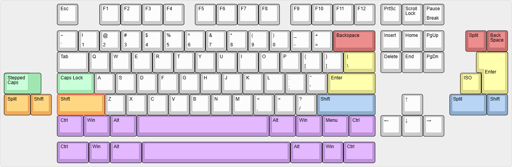
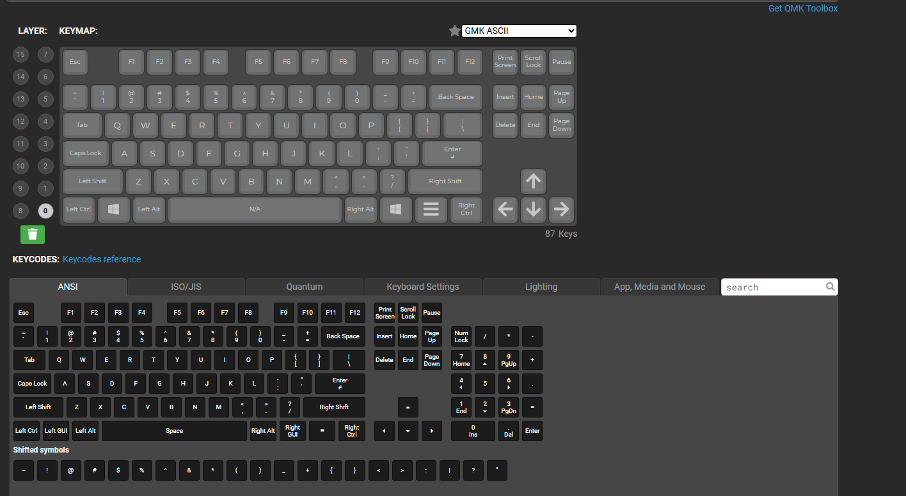

# TKL Keyboard
An F12 TKL Multi-Layout Hotswap keyboard, designed in KiCad10 and Fusion360. Everything in the 'Production' folder of this repository should be everything you need for the physical parts of this keyboard. Gerbers file can be provided to JLCPCB (or others) for them to manufacture the PCB. The STP files are used to 3D print the top case, bottom case, and plate.

KiCad Renders:
### 
### 

Keyboard Case:
### 
### 

## Features
* RESET Switch - allows you to reboot the keyboard's processor 
* BOOTSEL Switch - Allows you to load custom firmware onto the keyboard
* Uses the RP2040 MCU
* Uses Kailh Hotswap Sockets
* 16Mib Flash Memory
* 12MHz Crystal
* USB-C Port
* ESD Chip to prevent damage from electrostatic discharge
* Supports ANSI/ISO

## Multi-Layout Support
### 

## Firmware
Here's the basic keyboard layout (the one included in the 'Firmware' folder):
### 
You can edit it by uploading the JSON file in the 'Firmware' folder into QMK and making the necessary changes for the layout you want to use.
### Flashing Instructions
Hold the BOOTSEL switch while plugging the board into the computer (or map the key onto another keyboard). Your computer will recognize the keyboard as a new USB flash drive. Then, drag the .uf2 firmware file onto the drive which will flash and reconnect as your keyboard.

## BOM for everything but the PCB
These are just items I found online, obviously not everyone will have to buy everything or may find things cheaper.
| Item | Price | 
| -------- | -------- | 
| PORON Foam 3mm (https://kineticlabs.com/misc/kinetic/keyboard-case-foam) | $11.99 | 
| PORON Switch Pads 120pcs (https://www.thockking.com/products/120-pcs-poron-switch-pcb-pads-keyboard?srsltid=AfmBOoo6HK_r0ljKCA8shWPgEShMNSKvCRTplPMlUFCUZeMBYEVjpXQe) | $5.95 |
| PORON Gasket Pack (https://sneakbox.com/products/poron-gasket-pack-for-ava) | $2.50 |
| Rubber Feet for Grip 16pcs (https://www.amazon.com/Non-Slip-Replacement-Compatible-Keyboard-Appliance/dp/B0D4YMSKB4/ref=sr_1_11?dib=eyJ2IjoiMSJ9.XoUMk7-UOlTtPtFYWQZpOQQ0YV07qMV2vTZ3kSxIkSIlizGofOPVbTpGYzwRQw88zKSM_KaKzUI6qV4OeunmTbTU3q4nR0jaM8CfstdL5DCAXgpC3ANQ_niT6N3AHx2a1g9P4uldjTluwpxN1PMmYOOq9HpF6IvnZPEHAniQHR3mgzZNr9sqDr-lmo_pEqo7xObI15IINl3HmPJ3EgNBM4ETJDI--IO8IAdWWZ-Z_FE.Q2DZ8wJYTM9evpEy83jlTd3WV4KQYcCodQErPj6XfDI&dib_tag=se&keywords=computer+bottom+grips&qid=1783888312&sr=8-11) | $5.99 |
| PLA Jade White Filament - Refills (https://us.store.bambulab.com/products/pla-basic-filament?id=40475106640008&skr=yes&srsltid=AfmBOopkMxBwVVOAUPB-eUb1OnMVHz0YslsCtdrWvmvNn3WDPF1wTifkfaI) | $19.99 |
| PLA Dark Gray Filament - Refills (https://us.store.bambulab.com/products/pla-basic-filament?id=42844629008520&skr=yes&srsltid=AfmBOopkMxBwVVOAUPB-eUb1OnMVHz0YslsCtdrWvmvNn3WDPF1wTifkfaI) | $19.99 |
| Kailh Box White Mechanical Switches 108pcs (https://www.amazon.com/Zjmehty-Mechanical-Keyboard-Switches-Waterproof/dp/B0CBPQGBSF/ref=sr_1_3?dib=eyJ2IjoiMSJ9.E0cY7EpgxNWIGrjiUDijL2yX7QuJ4sSXQ3ni0V0YHDAgaGYgADZFwBu84mjhf-QysIyrwlpTxvjmzL0KDfYxlYY83vHiW4xgVClPXeF4Ib92ppCQysXUy_H-mAxLtrBvZS-ZL3z2GxEdb6f2pQ4qCblsv-kbjjwNlKHZ9bSdp37dGywsIBQwMoVVzmxqHsSfLnByHLKTMRRTwjsypfUzWYkZ373k-XDaxMY0TNUJ_mk.5vlHIp12Un8F6nijEipLgdprO-QfBAuDYCqbvLERydk&dib_tag=se&keywords=kailh%2Bswitches&qid=1783899117&sr=8-3&th=1) | $32.99 |
| Black on White Double Shot ABS Keycap Set 150pcs (https://mechanicalkeyboards.com/products/tai-hao-150-key-abs-double-shot-cubic-keycap-set-black-on-white) | $23.99 |
| M3x25mm + M3x35mm Screws (https://www.amazon.com/VGBUY-443Pcs-Assortment-Printer-Washers/dp/B0D14BC8QS/ref=sr_1_29?dib=eyJ2IjoiMSJ9.cJlzu8DHjxsBzA9lFsc42RrAUiLpBy2F3tkct2TerB3jPoWxLy1FFqgPkZL65Hm6hQ30CzHtc9XbV1b-KKiqKPhDFOW3YmMjd30Ejia8Nu6dS_fYUZJw2OaXmPkm66xulz6iDtLy41kDzPSHcQoN8hYNtvkRf0d3jzQRr0kr6lgkEKZoX19UdRjpKiqxOx5Y.NBmS5v4xF-mHcY9zdglMfK5eDmRY_j0mqYXsMdjWDFA&dib_tag=se&keywords=metric%2Bscrews%2Bm3&qid=1783871590&sr=8-29&xpid=46NRh2P79qy-c&th=1) | $9.99 |
| Total: | $127.39 | 

## Assembly (a little unconventional but I plan on making things easier in the future)
After 3D printing the bottom case, the 3mm PORON Foam should be laid inside of it, cut to fit. You could put the extra bits of foam in there but there should be at least a 1mm gap of air between the foam and the hotswap sockets. **The stabilizers should be installed onto the PCB before snapping the switches into the plate and PCB.** The PCB will have the PORON switch pads on it (for more sound modifications) and will be suspended by the switches (placed accordingly to whatever layout you want to use) secured by the plate. The plate itself will have the gaskets sandwiching the margins on all 4 sides of the plate (one on the top side of the margin, one on the bottom side). These gaskets will rest on the shelf located in the bottom case. The top case can then be placed and screwed on through the matching holes on the bottom plate. With how my current design is, the front end of the keyboards requires M3 x 23mm screws, and the back end requires M3 x 34mm Screws. In the future, I plan on making the case more suitable for standard screw sizes. But for now, I'm combating this by using a wire stripper tool. Screwing directly into 3D printed plastic creates debris, so make sure to clear that out. After securing the top case to the bottom case, all that's left is adding the keycaps for whatever layout you want.

